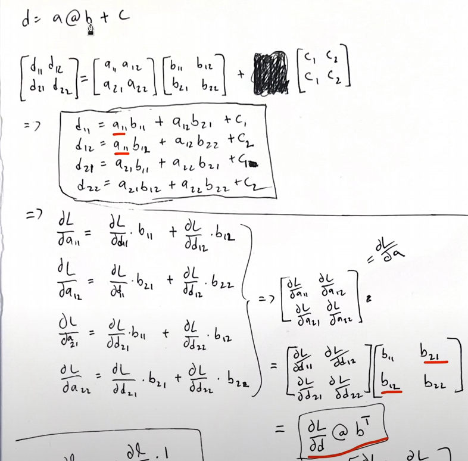
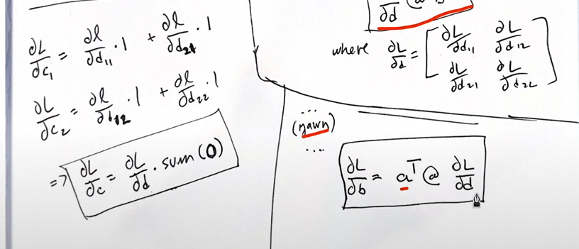
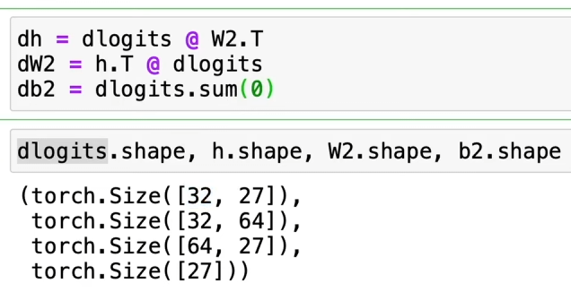

# Neural Networks: Zero to Hero

特斯拉前AI高级总监、斯坦福CS231n课程讲师**Andrej Karpathy**的《Neural Networks: Zero to Hero》课程学习。

[课程主页](https://karpathy.ai/zero-to-hero.html)
[课程视频](https://www.youtube.com/playlist?list=PLAqhIrjkxbuWI23v9cThsA9GvCAUhRvKZ)
[github主页](https://github.com/karpathy/nn-zero-to-hero)

## 1. Building micrograd

### 内容
1. 帮助重新理解前向传播、反向传播的原理及过程
2. 手动实现MLP并实现梯度下降过程

### 收获总结
1. 在实现运算的```_backward()```函数时，梯度使用的都是```+=```即累加，因此```zero_grad()```**梯度清零的过程特别重要！**

2. 运算过程是前向传播，梯度计算是反向传播。因此梯度计算是从最终的结果开始反向推（一般是从loss开始），**所有的梯度都是loss相对于其他变量的导数**，即```dloss / dx```。运用链式法则，如果有中间变量，那么梯度就变成了连乘```dloss / dy * dy / dx```。梯度的意义是：指示了如果变量x改变，loss会怎样改变。**例如loss相对于x的梯度为负数，说明loss会随着x的增加而减小，想减小loss就是让x增加。**

3. python自定义运算时，例如```__add__()```函数，调用```a + 1```就相当于调用```a.__add__(1)```。而```1 + a```就相当于调用```1.__add__(a)```，因此需要实现```__radd__()```函数进行转换，否则会报错因为1和类型a无法运算。

4. 安装```graphviz```库时，要用服务器管理员账号```sudo apt-get install graphviz```，因为涉及系统环境变量

## Building makemore part1

### 内容
1. 构建bigram语言模型（即哪个字母在另一个字母的后面，哪两个字母一起出现）
2. 训练集是真实的names，把它们拆分成字符对。例如"emma"在训练集中就是 ".-->e e-->m m-->m m-->a"


### 收获总结
1. pytorch的broadcast原则，切记```keepdim=True```特别重要
    1. 如果两个tensor的维度不同，pytorch会将维度自动**向右对齐**，然后新增维度，再进行广播运算。如下，如果运算时```keepdim=False```，计算出的张量是[27]，向右对齐后列向量颠倒过来变成了行向量；但如果```keepdim=True```，计算出的张量就是[1,27]
    ```
        27, 27  -->  27, 27  -->  27, 27
        27      -->      27  -->   1, 27
    ```
    
    2. 如果两个tensor的维度相同，pytorch会将数量为1的维度复制，进行广播运算
    ```
        27, 27  -->  27, 27
         1, 27  -->  27, 27
    ```

2. 每个字母用序号表示，输入神经网络时需要先one-hot编码。例如有27个不同的字符，将一个字符输入后，输出是27个小数。我们需要将神经网络的输出通过softmax转换为概率值，再通过negative log loss来计算loss并梯度下降。

3. one-hot之后，每个输入都是（batch, 27）。如果我们的权重W是(27, 1)，相当于1个神经元，有1个输出；如果权重W是(27, 27)，相当于27个神经元，有27个输出。**（矩阵运算，输入的每一行会跟W的每一列点乘，相当于所有的输入都进入了1个神经元，W的每一列就是一个神经元）**

4. 有的单词对出现次数为0，算梯度时会出现inf情况，因此需要model smoothing，即将每个单词对的出现次数都加1。**这个操作与正则化类似，都是想办法让每个单词对的概率接近，即分布更平滑。**（出现次数如果加很多，每个单词对的频率就很接近；正则化系数越大即W越接近于0，与输入乘积后概率值就越接近于0，每个单词对的频率也很接近）


## Building makemore part2

### 内容
1. 用MLP构建character-level语言模型
2. 模型数据集划分、训练、验证、调参

### 收获总结
1. pytorch索引很灵活，```C = torch.randn((27, 2))```是一个词表，可以通过```C[torch.tensor([32, 3])]```来索引，因此可以直接把一整个批次的X输入词表进行索引。输出的形状为```torch.Size([32, 3, 2])```

2. 调参以改变模型结构 (a)改变neuron的数量 (b)改变word embedding的维度 (c)改变输入字母数量的大小 (d)改变训练过程的参数，例如epochs，学习率及其衰减，batchsize等


## Building makemore part3

### 内容
在part2中需要优化的几个地方
1. 初始化：理想情况下，初始状态每个字母出现的概率应该是相等的，即1/27。
2. Dead Neuron(神经元死亡现象)

正确的初始化方式 & batch normalization

### 收获总结
1. 初始化：参数初始化如果不均匀，前面的epoch可能只是在将参数压缩到一个很小的范围内，而没有直接进行损失优化。**解决方案：最后映射到单词概率的层（softmax层）的参数W2，b2前面乘以一个很小的系数，使得各个概率的分布平滑一些。**
2. 死神经元（Dead Neuron）出现有两个可能的原因。**解决方案：权重前乘以一个很小的系数，控制激活函数前的输入的绝对值不要太大**
    1. **由于参数初始化问题**：在tanh之前的输入的绝对值太大，导致tanh激活后集中在+1和-1。而tanh函数反向传播的求导公式是1-tanh^2，因此梯度为0（或特别接近0），神经元死亡。即再往前反向传播梯度均为0，梯度下降过程参数根本不会更新。
    2. **学习率设置太高**：梯度正好很大，而学习率又设置的很高，权重W更新的就越大。如果权重一下子更新太大，导致无论什么训练样本经过权重计算后绝对值都很大，再经过激活函数后梯度为0，神经元死亡，同1。

3. 正确的初始化方式：使得输入x和经过x @ w的输出y的均值和方差接近，在反向传播过程中梯度的大小就能保持相对稳定。例如使用kaiming初始化等，之前只是简单的乘以一个很小的系数。**如果只是乘以一个很小的系数，经过激活函数例如tanh后输出值会被挤压，方差变小，因此在激活函数前要乘以一个增益值gain，例如tanh的gain为5/3来对抗激活函数的挤压，使得输出值保持相对稳定。**

4. 增益值gain：激活函数的增益值用来调控输入数量级和输出数量级之间的关系。不同的激活函数gain不同。当权重值过小，输入值每经过网络层方差都会缩小，例如sigmoid函数在0附近就变成了线性函数，失去了非线性特征；而如果权重值过大，输入值每经过网络层方差都会放大，输入大了梯度就会趋近于0，影响参数更新。

5. batch normalization: 在激活函数之前添加一个BN层，BN层的作用是网络层的输入和输出的均值和方差接近，使得激活函数的输入的分布更平滑。**BN使得网络训练更加鲁棒，而之前调节参数初始化需要十分小心**缺点是每一个样本在训练时，参数的更新都涉及到了同一批次中的其他样本，受到了本不该有的扰动（但其实对神经网络有利），因此其他例如layer normalization, group normalization等方法出现了。**（另：BN层之前不需要bias了，因此为均值除以方差的过程会抵消bias，且其本身就要x*γ+β）**


## Building makemore part4

### 内容
1. 手动计算back propagation，与pytorch自动loss.backward()结果进行比较

### 收获总结
1. 计算反向传播遇到**广播机制**时：如下例子，如果b的形状为```[3x3]```，那么```dc/db```就是```a```。但b是```[3,1]```，相当于```b```参与了三次计算（三列），每计算一次梯度就要累加一次，因此最终```dc/db```应该是每一行求和，即```[a11+a12+a13, a21+a22+a23, a31+a32+a33]```。
```
    # a[3x3] * b[3x1]  -->
    # a11*b1 a12*b1 a13*b1
    # a21*b2 a22*b2 a23*b2
    # a31*b3 a32*b3 a33*b3
    # c[3x3]
```
例如```probs = counts * counts_sum_inv```，并且counts形状是```[batch_size, vocab_size]```，而counts_sum_inv形状是```[batch_size, 1]```。因此```dprobs/dcounts_sum_inv```等于```counts.sum(dim=1, keepdim=True)```，```keepdim=True```是为了保持原来的形状即```[batch_size, 1]```

2. 如果某个变量在前向传播中被广播，进而参与了多次运算，反向传播计算梯度时要**累加**。（如exercise1中的dcounts）

3. 与2相反，如果某个变量在前向传播中被沿着行或列sum，则反向传播计算梯度时需要广播，因为梯度对每个分量都是相等的。例如```bnvar = 1/(n-1)*(bndiff2).sum(0, keepdim=True)``` ---> ```dbndiff2 = (1.0/(n-1)) * torch.ones_like(bndiff2) * dbnvar```。其中```dbnvar.shape=[1, 64], bndiff2.shape=[32, 64]```。如下面简单的例子，```dbnvar```就是```b```，其中```db1/da11```和```db2/da21```都等于```1/(n-1)```，因此如果想还原成```bndiff2```的梯度，直接将```dbnvar```复制32行即可，可以用广播实现。
```
# a11 a12
# a21 a22
# --->
# b1  b2, where
# b1 = 1/(n-1)*(a11+a21)
# b2 = 1/(n-1)*(a12+a22)
```

4. **矩阵运算**的反向传播：通过简单例子的矩阵相乘得到梯度计算公式
    1. 法1：手算推导 
    
    
    2. 法2：通过维度判断（凑维度，例如```dh```是```dlogits```与```dW2```的某种运算，而```h```的维度与```dh```相同一定是```[32, 64]```，因此只能是```[32, 27] @ [27, 64]```凑出，即```dlogits @ W2.T```）
     

5. Exercise2 & 3: To be continued...


## Building makemore part5

### 内容
1. 实现WaveNet的架构
2. 将训练过程序列化、结构化


## Building GPT

### 内容
1. 实现字符级别的GPT模型

### 收获总结
1. - **self-attention:** q,k,v都是来自同一个序列，因此叫自注意力机制，我们只关注于自身节点的交流；
    - **cross-attention:** k,v来自外部，我们用输入q来找到并融合相关的外部信息。

2. 
    \[
    \text{Attention}(Q,K,V)=\text{softmax}(\frac{QK^T}{\sqrt{d_k}})V
    \]除以根号下dk的操作叫scale，用于控制QK乘积后的数值的方差，因为softmax会收到数值差距的影响，如果数字差距很大，softmax的输出会趋近于one-hot
